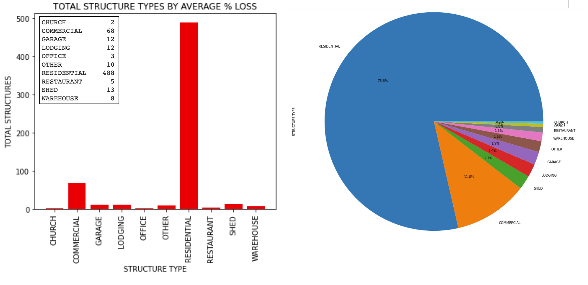

# Dallas_Building_Fire  
### Daniel Czornyj  
### Robert Gonzalez  
### Robert Lane  
### Cody Sultenfuss  
## Purpose  
To perform exploratory analysis on building fires within the city limits of Dallas, Texas.  
## Conclusions  
### Cleanup and Initial Charting

<figure><figcaption align = "center"><i>Initial Logged Causes of Fire</i></figcaption></figure> 

We started out our analysis by dropping unneeded columns by using .drop() and then we needed to get rid of unuseful rows by using .loc[] with a condition to get rid of cars in our dataset, because we only wanted buildings. Then we renamed and split up some columns and we where ready to go. In the first chart,  I charted all of the causes using .value_counts. The majority of cases (27%) have an undetermined cause. This was surprising at first, but, perhaps fires after the fact, are mysteries in the way they’re started because the evidence simply burns up.  

<figure><figcaption align = "center"><i>Building Stories vs. Avg % Loss to Fire</i></figcaption></figure> 

We next explored building stories vs percentage loss. 1-2 stories have the highest percentage loss out of the data available. Furthermore, 74 percent of structure types in the data set are dwellings or apartments. This makes since, because the the vast majority of stories in this data set are one to two story buildings. Also checking structure type vs percentage loss, the structure with the highest percentage loss are sheds, at 30% loss after a fire. Sheds are not in the dwelling category and is their own category. 
 
The Data frame has a condition that only allows less than 100 stories to be in the dataframe. Tallest building is 26 stories. The data set is more representive of neighborhoods, apartment complexes, and commercial buildings almost all in the one to two building story range. 

<figure><figcaption align = "center"><i>Time of Day vs. % Value Lost in Fire</i></figcaption></figure> 

My last big task was to convert the time column so it could be used in plotting. The column needed to be split into three different columns hour, am/pm, and minutes. I than omitted minutes and did a gropby.mean on am/pm in the index by  percentage loss. After that I took my new variable and put through a loop and used enumerate to add AM and PM and the number in one unit so it could be used in the plot. You can see after the work was done that the Highest percentage loss at 29 percent happens between 5:00 and 6:59 AM

### Zoning in on Fire Battalions

Firstly, we felt it would be important to initially plot each fire (by address and lat + lng as generated with the geocoding API) within our chosen dataset to obtain a strong illustration of how our data is distributed on a geographic scale

This map reflects all 621 fires from the dataset after the conclusion of the clean-up process.

Here we see each fire plotted again but with the added addition of a heat layer. This heat layer reflects the % Value loss (Initial value of property-value saved/100) of each fire. % Value Loss will continue to serve as one of our main drawing points throughout the rest of our analysis. 

The closer in color to red indicates areas in which fires caused a higher % Value loss. 

With % Value Loss being one of our main points of reference that we were looking to connect with various other variables throughout the dataset, the above two graphs provide us with a greater understanding of how the damage from fires differs based on the battalion that responded to each fire. 

<figure><figcaption align = "center"><i>Battalion Fire Damage Charts</i></figcaption></figure> 

The left bar chart tells one of the average % Value Loss in Fires by Battalion. The right side expresses the median % value loss in fires by battalion. 

<figure><figcaption align = "center"><i>Battalion map</i></figcaption></figure> 

The median chart helps one to understand the array of values by each Battalion which helps us to explain how some data may be skewed.  For instance, while Battalions 1, 5,8 & 9 have the highest average % value loss in fires by Battalion, Battalion 1 has a noticeably smaller median value amongst that battation’s distribution for % Value Loss.

Immediately, when looking at the average % Value Loss bar chart, one notices the fires responded to by Battalion 2 reflect the lowest average % Value Loss amongst battalions within the Dallas Fire Department

Conversely, We can also see that fires responded to by Battalions 1, 5, 8, and 9 express the highest Average % Value Loss in Fires.

These two above points will become apparent in the below analysis, which delves deeper into Dallas Fire Department next. 

### Correlations, Station Coverage, & Alarm Systems

<figure><figcaption align = "center"><i>Correlation of Cleaned Data</i></figcaption></figure> 

This portion of the analysis started with correlation heatmaps.  Although there are a handful of strong correlations shown in the chart, they proved to not be particularly useful: location corresponds with council district, ID with index, and structure loss with total loss.

<figure><figcaption align = "center"><i>Correlation between Census Household Income and Fire Damage</i></figcaption></figure> 

This correlation chart compares loss to fire against block-level census data for household income.  The main conclusion to be drawn is that people of similar income levels tend to live close together.

There is a weak negative correlation between high income and percentage of value loss, but because it doesn’t correlate with total loss, this can be interpreted merely as high income families living in high value homes.

<figure><figcaption align = "center"><i>Distance to Nearest Fire Station</i></figcaption></i></figure><figure><figcaption align = "center"><i>Distance to 2nd-Nearest Fire Station</i></figcaption></i></figure> 

I had a few issues with the way this heatmap stacks values.  Most of the map seems to correctly get redder when it’s farther away from a fire station, but the lower-right area seems to be an anomaly.  I initially used Google Places API, but that took a lot of time.  I made a second attempt which measured the distance for every point in Dallas to every fire station, then picked the closest two for each point.  It ended up not fixing the anomaly.

<figure><figcaption align = "center"><i>Sprinkler & Alarm Counts</i></figcaption></i></figure> 

While the r-value is under 0.5, this represents one of the stronger correlations found during this analysis.

<figure><figcaption align = "center"><i>Sprinkler & Alarm Correlation</i></figcaption></i></figure> 

Only 3 fires were noted which had a sprinkler but no alarm.

What we learned from this was that API calls are not always the most efficient way to process data.  A series of 961 API calls to get an even spread of points for the city took about 5 minutes.  The haversine formula calculated distances on a sphere using latitude and longitude, and processed about 30,000 comparisons in under 10 seconds.  It may be cheaper and faster to download whatever data you can get first, and then find a way to process it yourself.

  
   

<i>Left: Percentage of loss, linear scale.  &nbsp;&nbsp;&nbsp;&nbsp;&nbsp;&nbsp;&nbsp;&nbsp;&nbsp;&nbsp;&nbsp;&nbsp;&nbsp;&nbsp;&nbsp;&nbsp;&nbsp;&nbsp;&nbsp;&nbsp;&nbsp;&nbsp;&nbsp;&nbsp;&nbsp;&nbsp;&nbsp;&nbsp;&nbsp;&nbsp;&nbsp;&nbsp;&nbsp;&nbsp;&nbsp;&nbsp;&nbsp;&nbsp;&nbsp;&nbsp;&nbsp;&nbsp;&nbsp;&nbsp;&nbsp;&nbsp;&nbsp;&nbsp;&nbsp;&nbsp;&nbsp;&nbsp;&nbsp;&nbsp;&nbsp;&nbsp;&nbsp;&nbsp;&nbsp;&nbsp;&nbsp;&nbsp;&nbsp;&nbsp;&nbsp;&nbsp;&nbsp;&nbsp;&nbsp;&nbsp;&nbsp;&nbsp;&nbsp;&nbsp;&nbsp;&nbsp;&nbsp;&nbsp;&nbsp;&nbsp; Right: Total value lost, LOGARITHMIC scale.</i>  

There were only 3 fires in buildings that had a sprinkler but no alarm.  While it’s included in this chart, there’s not much we can determine from that data.

|                      | **TOTAL LOSS** |          |            |            |         |            |         | **PERCENTAGE LOSS** |          |            |         |         |         |
|----------------------|:--------------:|:--------:|:----------:|:----------:|:-------:|:----------:|:-------:|:-------------------:|:--------:|:----------:|:-------:|:-------:|:-------:|
|                      |    **count**   | **mean** | **median** |   **max**  | **min** |   **sum**  | **std** |      **count**      | **mean** | **median** | **max** | **min** | **std** |
| **SYSTEM INSTALLED** |                |          |            |            |         |            |         |                     |          |            |         |         |         |
|    **Alarm Only**    |            181 |  $31,395 |     $5,500 |   $950,000 |       0 | $5,682,500 |   89249 |                 181 |     8.65 |       0.97 |   94.58 |    0.00 |   15.65 |
|       **Both**       |             66 |  $38,722 |     $1,500 | $1,502,000 |       0 | $2,555,630 |  186095 |                  66 |     1.63 |       0.02 |   48.02 |    0.00 |    7.04 |
|      **Neither**     |            161 |  $24,005 |     $8,000 |   $428,000 |       0 | $3,864,725 |   49099 |                 161 |    16.57 |       4.17 |   86.74 |    0.00 |   22.65 |
|  **Sprinkler Only**  |              3 | $184,500 |     $2,500 |   $550,000 |    1000 |   $553,500 |  316533 |                   3 |    14.47 |       1.49 |   41.83 |    0.08 |   23.71 |

The highest damage incurred here was on a building that had both alarm and sprinkler.  Its total damage was about $1.5 million.  However, no property listed here lost more than 50% of its value when it had both systems installed during the year 2020.

Mean damage is useful, but can be heavily skewed when you have a big outlier.  A damage of $1.5 million can certainly do that, especially considering that the majority of fires happen in homes with total values far smaller.

With that in mind, median is a bit more useful at showing the damage incurred by the average instance of fire.  The most dramatic difference is found when you look at median percentage loss.  Having both systems installed corresponds with a smaller loss than having neither by a factor of over 200.  This may be in part because buildings which invest in having both installed may already be of higher value, and may also implement regular fire drills to lower insurance costs.  This would be another hypothesis which is not explored during this analysis.

### The Cost of Structure and Construction

To evaluate the effect structure type and construction material had in relation to percent value loss.

Here, we first ran a .unique() for the parameter Structure Type to determine the various types of structures we were dealing with. The initial return of structure types displayed a large amount of repetitive misspelled structure types and/or  “like” structure type names. 

A .replace() was performed to clean the dataframe further by consolidating names that were the same, similar, or alike. ie: apartment and apartments, condo and condominiums, and hotel and motel. As demonstrated by the figures on the slide, a .groupby() was performed to determine the average percent loss by structure type. 

A rather interesting result from this analysis was that sheds accounted for the greatest “AVERAGE % LOSS in FIRES” for structure type. From this analysis, a theory could be formulated that the reason for this observation is the total cost of SHED’s are lower than other structure types and therefore any damage accrued during a fire would result in a greater percent loss.

Furthermore, further evaluation of the dataset proved to allow for further data cleaning by grouping all structures in residential nature together. 

<figure><figcaption align = "center"><i>Structure Types Involved with Fires</i></figcaption></figure> 

The two charts depicted on this slide show the ‘Total Structure Types’ for the dataset with the new category residential structure type added. To no surprise, residential structure type returned an overwhelming total number of structures from the data set. This information confirmed one theory that the majority of all fires occur within the home. 

As evidenced by both of the generated bar and pie charts, this clear landslide of a total was followed by the commercial structure types in a distant 2nd and the rest of the structures types attributing to minimal totals. 

<figure><figcaption align = "center"><i>Material Types Involved with Fires</i></figcaption></figure> 

A pie chart is presented here to further visualize the total construction types by percentage. 
As expected, wood materials again show an overwhelming percentage of the total construction type involved in Dallas fires. 
From there, the percentages drop off dramatically.

<figure><figcaption align = "center"><i>Map of Fire Types</i></figcaption></figure> 

Once again, I further wanted to evaluate each specific construction types location within the city of Dallas as well as its proximity to hot zones for high Percent Loss. Therefore, once again using the Heatmap displayed by earlier in the presentation I performed an overlay of the specific construction types on the heatmap. 
Since the initial code was developed to run previously for structure types, this process was much quicker than its predecessor. However, again, because a variable was not being used to describe construction type, a .loc was used to again locate the unique construction types in the dataset. Each of the 5 construction types where then further color coded and layered onto the map to indicate their exact locations.
From the map, an observation can be made that the majority of fires, regardless of construction type (with the majority being wood) tend to occur in Central to South Dallas vs North Dallas. 
A theory could be established that this may due to economic wealth and growth of the city in terms of older parts of the city vs. newer.
Further analysis should be conducted to further validate this theory.

## Files
·       alarm.ipynb
o   Demonstrates correlation between fire alarm & suppression systems and extent of damage from fires.
·       Building_Fire.csv
o   Untouched data source from City of Dallas
·       census.ipynb
o   Pulls Census data (block-level) for locations listed based on latitude and longitude.
·       Correlation_matrix.ipynb
o   Shows potential correlation between columns in a dataframe.  Useful for starting analysis.
·       Fire_Charts.ipynb
o   Initial charts which describe 
·       FirePy – Geocode.ipynb
o   Majority of data cleaning occurs here.
o   Gathers geo data for fires.
·       firestation_geocode.ipynb
o   Gathers geo data for City of Dallas fire stations
·       haversine.py
o   Requires (latitude, longitude, latitude1, longitude1, unit (km or mi, km is default)).
o   Returns distance between two points with lat / lng at sea level on Earth.
·       improved station distance.ipynb
o   Uses Haversine formula to determine distance to two nearest fire stations.
o   Much, much faster than API.  Calculated ~36,000 distances in under 10 seconds, but strictly requires that all lat / lng points are already provided.
·       Nearest_Fire_Stations.ipynb
o   Uses Google Geocode API to determine distance to two nearest fire stations.
·       Time vs Fire Frequency.ipynb
 
·       data/Dallas_coords_census_data.cscv
o   Adds census data and fire damage summary to Dallas coords (two files down)
·       data/Dallas_coords_grid.csv
o   Adds fire data to evenly spaced grid (next file).
·       data/Dallas_coords_only.csv
o   Stores an evenly spaced gride of points which lie inside City of Dallas.
·       data/fire_census.csv
o   Stores fires lat / lng, fire damage, and census data.
o   Census data pulled from Geocod.io
·       data/fire_stations.csv
o   Stores addresses of all 58 Dallas fire stations.  Lat / Lng determined by Geocode.
 Data Sources
Primary Fire Data: https://www.dallasopendata.com/Public-Safety/Building-Fire/skju-bfp8
Census Data: https://geocod.io
Google Places API
Google Geocode API

